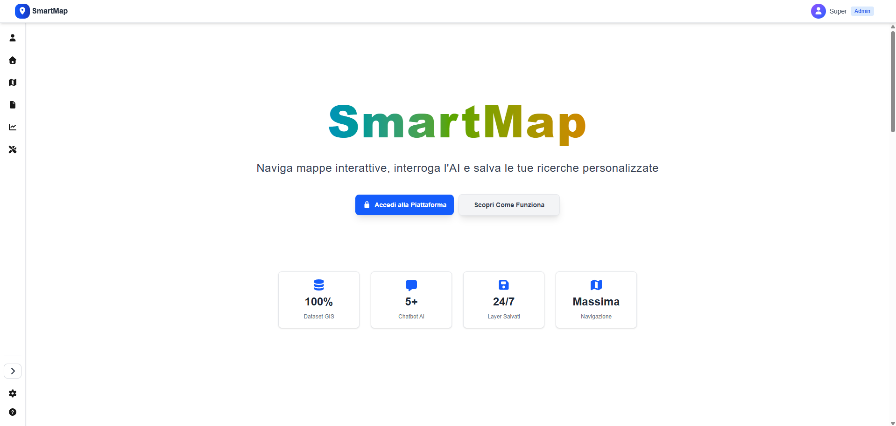
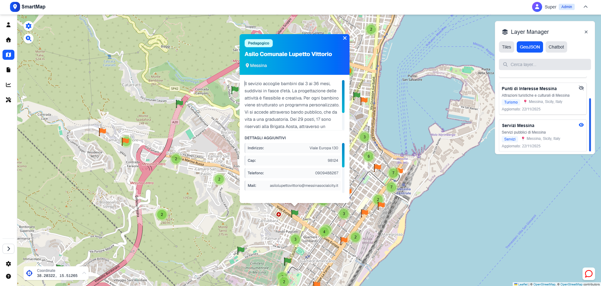
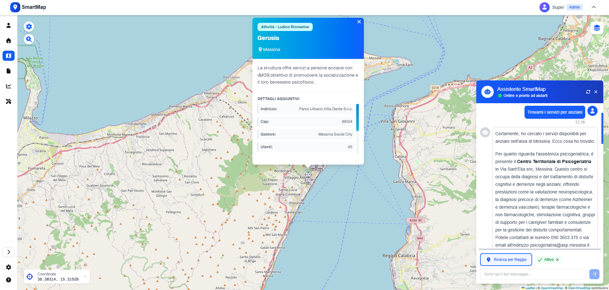
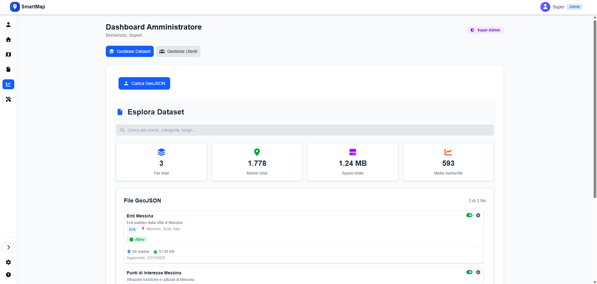
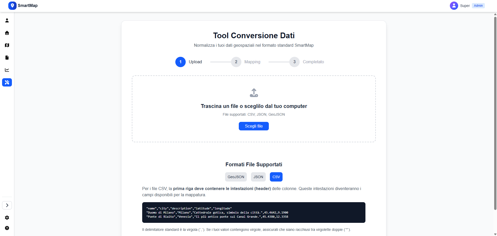

# 🌍 SmartMap - WebGIS Platform

<!-- BADGES PROJECT STATUS -->


<!-- BADGES TECH STACK -->

[](https://www.typescriptlang.org/)
[](https://nextjs.org/)
[](https://react.dev/)
[](https://tailwindcss.com/)
[](https://www.prisma.io/)
[](https://leafletjs.com/)
[](https://www.postgresql.org/)
[](https://www.docker.com/)
[](https://web.dev/progressive-web-apps/)

**SmartMap** è una piattaforma WebGIS progettata per la gestione, l'esplorazione e l'analisi intelligente di dati geospaziali.

Il sistema integra un'architettura moderna Full-Stack con un **Chatbot basato su IA (RAG)**, permettendo agli utenti di interrogare dataset complessi utilizzando il linguaggio naturale e visualizzare i risultati dinamicamente sulla mappa.

> 🎓 **Contesto Accademico:** Questo progetto è stato sviluppato come Tesi di Laurea in Informatica, focalizzandosi sull'ingegneria del software, l'architettura a microservizi e l'interoperabilità dei dati.

---

## 🚀 Features Principali

### 🗺️ Visualizzazione & Core GIS

- **Mappa Interattiva:** Rendering con _Leaflet.js_ e _React-Leaflet_.
- **Clusterizzazione:** Gestione efficiente di migliaia di marker tramite `leaflet.markercluster`.
- **Gestione Layer:** Sistema di attivazione/disattivazione dinamica per dataset GeoJSON e mappe di base (OSM, Satellite, Topografica).
- **Lazy Loading:** Strategia di caricamento dati ottimizzata per ridurre il consumo di memoria e latenza.

### 🤖 Integrazione IA & Chatbot

- **Query in Linguaggio Naturale:** Interfaccia conversazionale per richiedere analisi spaziali (es. _"Trova i servizi per anziani nel raggio selezionato"_).
- **Rendering Dinamico:** Il chatbot genera la risposta testuale, mentre SmartMap si occupa di creare e proiettare layer temporanei sulla mappa in tempo reale.
- **Persistenza:** Possibilità per gli utenti registrati di salvare le risposte e le analisi generate dall'IA nella propria dashboard.

### 🛠️ Strumenti di Amministrazione (ETL)

- **Tool di Conversione Dati:** Motore di normalizzazione integrato per convertire file eterogenei (CSV, JSON, GeoJSON) nello standard GeoJSON della piattaforma.
- **Mapping Assistito:** Interfaccia grafica per mappare colonne e proprietà senza scrivere codice.
- **Validazione Strict:** Sistema di controllo qualità dei dati a doppio livello (Client-side & Server-side).

### 🔐 Sicurezza & Utenti

- **RBAC (Role-Based Access Control):** Gestione granulare dei permessi (User, Admin, Super Admin).
- **Autenticazione:** Sistema sicuro basato su JWT (HttpOnly Cookies) e Bcrypt.
- **Progressive Web App (PWA):** Installabile su desktop e mobile.

---

## 🤝 Ecosistema e Collaborazione

Questo progetto è frutto di una collaborazione tecnica sinergica per la realizzazione di un sistema **GeoAI** completo. L'architettura è disaccoppiata in due componenti principali:

| Componente          | Responsabile           | Descrizione                                                                                 | Repository                                                               |
| :------------------ | :--------------------- | :------------------------------------------------------------------------------------------ | :----------------------------------------------------------------------- |
| **WebGIS Platform** | **Me**                 | Architettura Frontend/Backend, UI/UX, Gestione Dati, Tool ETL.                              | _Questo Repository_                                                      |
| **RAG AI Agent**    | **Giovanni Pio Zullo** | Sistema di Chatbot AI basato su RAG (Retrieval-Augmented Generation) per query geospaziali. | [Vai al Repository](https://github.com/Gianniz03/geospatial-rag-chatbot) |

---

## 🏗️ Architettura Software

Il progetto segue i principi della **Clean Architecture** e del **Feature-Sliced Design** per garantire manutenibilità e scalabilità.

### Stack Tecnologico Dettagliato

| Categoria           | Tecnologie                                                       |
| :------------------ | :--------------------------------------------------------------- |
| **Frontend Core**   | Next.js 15 (App Router), React 19, TypeScript                    |
| **UI & Styling**    | Tailwind CSS 4, FontAwesome (Icons)                              |
| **GIS & Maps**      | Leaflet, React-Leaflet, Leaflet.markercluster, Leaflet-Geosearch |
| **Backend**         | Next.js API Routes (Serverless functions pattern)                |
| **Database & ORM**  | PostgreSQL, Prisma ORM                                           |
| **Data Processing** | PapaParse (CSV Parsing)                                          |
| **Sicurezza**       | Bcrypt (Hashing), JWT (Sessioni)                                 |
| **PWA**             | @ducanh2912/next-pwa                                             |

### 📂 Struttura del Progetto

<details>
<summary><strong>🔍 Clicca per esplorare la struttura delle directory</strong></summary>
<br>

```bash
.
├── .next/                  # Build di produzione generata da Next.js
├── docs/                   # Documentazione tecnica aggiuntiva
├── prisma/                 # Schema del database, seed e migrazioni SQL
├── public/                 # Asset statici pubblici (icone, immagini, manifest PWA)
├── src/                    # Codice sorgente dell'applicazione
│   ├── app/                # Next.js App Router (Pagine, Layout e API Routes)
│   ├── backend/            # Business Logic Layer (Controller, Service, Repository, DTO)
│   ├── components/         # Componenti UI "Dumb" condivisi (Button, Modal, Input)
│   ├── configs/            # Configurazioni globali e costanti di sistema
│   ├── contexts/           # State Management globale (Auth, Mobile, UI)
│   ├── features/           # Moduli funzionali (Pattern Feature-Sliced Design)
│   │   └── [domain]/       # Ogni cartella (map, chatbot, tool) è un modulo isolato
│   ├── hooks/              # Custom Hooks trasversali
│   ├── styles/             # Stili globali e configurazioni Tailwind
│   ├── types/              # Definizioni TypeScript condivise
│   ├── utils/              # Funzioni helper e utility pure
│   └── middleware.tsx      # Edge Middleware per sicurezza e routing
├── storage/                # Layer di persistenza ibrida (File System)
│   └── datasets/           # Repository fisico per i file GeoJSON e allegati
├── docker-compose.yml      # Orchestrazione container (App + PostgreSQL)
├── Dockerfile              # Istruzioni di build per l'immagine di produzione
├── next.config.ts          # Configurazione del framework Next.js e PWA
├── package.json            # Dipendenze del progetto e script NPM
└── tsconfig.json           # Configurazione TypeScript
```

<br>
</details>

## 📸 Anteprima

Home page


Map


Query


Dashboard


Tool


## 🔧 Installazione e Avvio

## Descrizione

Questo progetto SmartMap utilizza Docker Compose per gestire un ambiente con un database PostgreSQL e un'app Node.js (con Prisma ORM). Lo scopo è standardizzare l’installazione e l’avvio, facilitando lo sviluppo e il deploy.

---

## Prerequisiti Tecnici

- Docker e Docker Compose configurati
- Familiarità con Docker CLI e terminale
- Connessione internet per iniziale setup

---

## Come funziona

1. **Docker Compose** crea due container:

   - `db`: un PostgreSQL 15-alpine con configurazione e volumi persistenti
   - `app`: container Node.js con il codice del progetto e dipendenze installate automaticamente nel build

2. Le variabili d’ambiente vengono caricate da un file `.env`, in particolare:

   - Il `DATABASE_URL` utilizza come host il nome del container `db` (non `localhost`) per permettere la comunicazione interna tra container tramite rete Docker.

   > **Nota:** `db:5432` deve corrispondere al nome del servizio database nel `docker-compose.yml`, è così che l’app trova il database.

3. Il container app NON esegue automaticamente il build o l’avvio (`npm run build` e `npm run start`) per lasciar controllare manualmente all’utente quando eseguire questi comandi.

4. I file di codice del progetto sono montati come volume nel container app, quindi devono sempre restare sul filesystem locale; eliminarli causerà problemi al container.

---

## Uso

1. Clona il progetto
2. Copia `.env.example` in `.env` e aggiorna eventuali segreti o configurazioni personali
3. Da terminale avvia i container con:

```bash
docker compose up --build
```

4. Avvia un altro terminale ed entra nel container app per eseguire manualmente i comandi:

```bash
docker exec -it smartmap-app sh
npm run build        # compila il progetto

# ⚠️ Prima volta o sviluppo locale: crea e applica la migrazione iniziale
npx prisma migrate dev --name init

# ⚠️ Successivamente, in produzione o container già pronto: applica solo le migrazioni esistenti
# npx prisma migrate deploy
# Nota: se è la prima volta, esegui solo il comando sopra (migrate dev) e ignora deploy

npx prisma db seed           # FACOLTATIVO popola DB con dati iniziali
npm run start         # avvia l'app
```

> ⚠️ **Nota:** Se non esegui `npx prisma db seed`, dovrai creare manualmente un account super admin (ad esempio tramite Prisma Studio o `psql`).  
> Se invece esegui il seed, viene già creato un account **superadmin** con:
>
> - Email: `superadmin@platform.com`
> - Password: `superadmin123`
>
> Se non fosse soddisfacente, puoi personalizzare i dati iniziali modificando il file prisma/seed.ts con i valori desiderati, quindi rieseguire il comando di seeding per aggiornare il database.

---

# Accesso Applicazione e DB

- Dopo `npm run start`, l’app è disponibile su [http://localhost:3000](http://localhost:3000)
- Prisma Studio è disponibile su [http://localhost:5555](http://localhost:5555) tramite `npm run db:studio`

---

## Cosa fare attenzione

- **Non eliminare la cartella del progetto** mentre i container sono attivi perché i volumi montati ne dipendono.
- Tenere sempre aggiornati i file di migrazione e i seed per evitare errori dovuti a mancanza di tabelle.
- Modificare correttamente il `.env`, in particolare usare sempre `db` come hostname per il database.
- Il container postgres mantiene i dati persistenti nel volume `postgres_data`.

---

## 💻 Sviluppo e Modifica del Codice

Per modificare il codice sorgente di SmartMap, le dipendenze necessarie (`node_modules`) risiedono esclusivamente all'interno del container Docker. Per accedere a un ambiente di sviluppo completo con IntelliSense e autocompletamento, è consigliato utilizzare **Visual Studio Code** con l'estensione **Dev Containers**.

### Prerequisiti per lo Sviluppo

- Docker e Docker Compose configurati
- [Visual Studio Code](https://code.visualstudio.com/)
- Estensione [Dev Containers](https://marketplace.visualstudio.com/items?itemName=ms-vscode-remote.remote-containers)

### Setup Ambiente di Sviluppo

Dopo aver eseguito i passaggi della sezione "Installazione e Avvio":

1. **Connettiti al container con VS Code:**

   - Apri Visual Studio Code
   - Premi `F1` (oppure `Ctrl+Shift+P` su Windows/Linux o `Cmd+Shift+P` su macOS)
   - Digita e seleziona: **`Dev Containers: Attach to Running Container...`**
   - Seleziona il container **`smartmap-app`** dalla lista
   - VS Code si riaprirà connesso al container

2. **Apri la cartella del progetto:**

   - Nel VS Code connesso al container, vai su: **File → Open Folder**
   - Seleziona la cartella: **`/app`**
   - Ora puoi iniziare a programmare con IntelliSense completo!

3. **Comandi di sviluppo:**

   Usa il terminale integrato di VS Code (già connesso automaticamente al container) per eseguire i comandi elencati nella sezione "Tooling & Sviluppo".

> 💡 **Nota per utenti avanzati:** È possibile modificare i file anche con altri editor, ma senza accedere al container non avrai supporto IntelliSense. Per eseguire comandi, usa sempre `docker exec -it smartmap-app sh`.

---

## 🛠️ Tooling & Sviluppo

Il progetto include script di utilità per facilitare lo sviluppo e la manutenzione.

| Comando               | Descrizione                                                                                                                                                |
| :-------------------- | :--------------------------------------------------------------------------------------------------------------------------------------------------------- |
| `npm run dev`         | Avvia l’app in modalità sviluppo su `http://localhost:3000` con hot-reload.                                                                                |
| `npm run build`       | Compila l’app per la produzione ottimizzata.                                                                                                               |
| `npm run start`       | Avvia l’app compilata in modalità produzione.                                                                                                              |
| `npm run lint`        | Esegue il controllo statico del codice con ESLint per garantire la qualità.                                                                                |
| `npm run db:generate` | Genera il client Prisma a partire dallo schema.                                                                                                            |
| `npm run db:migrate`  | Esegue le migrazioni del database in sviluppo.                                                                                                             |
| `npm run db:push`     | Sincronizza lo schema Prisma con il database senza creare migrazioni.                                                                                      |
| `npm run db:seed`     | Popola il database con i dati iniziali definiti nello script di seed.                                                                                      |
| `npm run db:reset`    | Resetta il database (cancella tutto) e riesegue il seed dei dati iniziali.                                                                                 |
| `npm run db:studio`   | **Database GUI:** Avvia Prisma Studio su `http://localhost:5555`. Permette di visualizzare e modificare i record del database tramite interfaccia grafica. |
| `npm run db:fresh`    | Cancella tutte le migrazioni e ricostruisce il database da zero, eseguendo anche il seed.                                                                  |

> Nota: Durante lo sviluppo è stato utilizzato un mock della risposta del chatbot per facilitare i test front-end. L'implementazione reale dell'API è presente nel codice ma commentata.
---

### 📖 Documentazione e Risorse
Consulta la documentazione ufficiale per approfondire i principali strumenti usati:
- **[React](https://react.dev/reference/react)**
- **[Next.js](https://nextjs.org/docs)**
- **[React-Leaflet](https://react-leaflet.js.org/docs/start-introduction/)**
- **[Leaflet](https://leafletjs.com/reference.html)**
- **[PapaParse](https://www.papaparse.com/)**
- **[Prisma ORM](https://www.prisma.io/docs)**
- **[PostgreSQL](https://www.postgresql.org/docs/18/index.html)**
- **[@ducanh2912/next-pwa](https://github.com/DuCanhGH/next-pwa)**
### 🌟 Crediti e Risorse Esterne
Un ringraziamento speciale alle risorse open source e agli asset gratuiti che hanno reso possibile lo sviluppo di questo progetto:
#### 🗺️ Mappe & Servizi Geografici
- [OpenStreetMap](https://www.openstreetmap.org/) – Dati cartografici forniti dai contributori OSM.
- [OSM HOT](https://www.hotosm.org/) – Layer Humanitarian OpenStreetMap Team.
- [OpenTopoMap](https://opentopomap.org/) – Mappe topografiche con rilievi e dettagli naturali.
- [OpenSeaMap](http://www.openseamap.org/) – Carte nautiche con porti e segnali marittimi.
- [Nominatim](https://nominatim.org/) – Servizio di geocodifica basato su OpenStreetMap.
- [Esri World Imagery](https://www.esri.com/) – Immagini satellitari ad alta risoluzione da endpoint pubblici.
- [Esri World Street Map](https://www.esri.com/) – Mappe stradali dettagliate da endpoint pubblici.
#### 🎨 Icone & Asset Grafici
- [FontAwesome](https://fontawesome.com/) – Icone UI.
- [UXWing](https://uxwing.com/) – Icone vettoriali utilizzate nei marker e nella UI.

---

## 📄 Licenza

Distribuito sotto licenza MIT. Vedi il file `LICENSE` per maggiori informazioni.

---

<p align="center">
  Sviluppato con ❤️ tra studio e caffè.
</p>